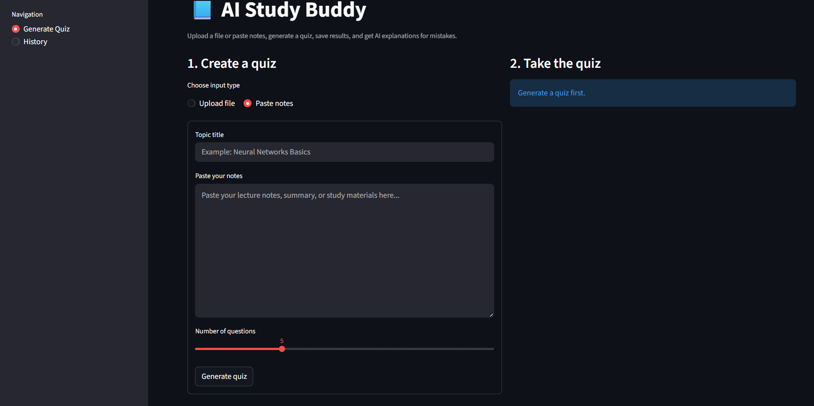

# AI Study Buddy

An AI-powered study assistant that turns notes or uploaded study files into quizzes for active recall.

## Demo

### Generate Quiz page (file upload)



### Generate Quiz page (paste notes)


### History and explanations page


## Product context

### End users
- Students preparing for quizzes, exams, and coursework.
- Learners who already have notes, lecture materials, summaries, or reading files.

### Problem
Students often have study materials, but they do not have a fast way to convert those materials into active-recall practice. Writing quiz questions manually takes time, and it is hard to track mistakes across study sessions.

### Solution
AI Study Buddy lets the user paste notes or upload a TXT, MD, PDF, or DOCX file, generates a multiple-choice quiz, saves quiz history, and explains incorrect answers.

## Version 1 and Version 2

### Version 1
- Paste notes into the app.
- Generate a quiz.
- Answer questions and save the score.

### Version 2
- Upload study files instead of only pasting notes.
- Save quiz history in SQLite.
- Generate AI explanations for mistakes.
- Use OpenRouter-compatible models so the product is easier to run with free-tier models.

## Features

### Implemented features
- FastAPI backend API.
- Streamlit web client.
- SQLite database for quiz history.
- Quiz generation from pasted notes.
- Quiz generation from uploaded TXT, MD, PDF, and DOCX files.
- Adjustable number of quiz questions.
- Saved score history.
- AI explanations for wrong answers.
- Dockerized frontend and backend.

### Not yet implemented
- User accounts and authentication.
- Flashcard mode.
- Export of quiz results to PDF or CSV.
- OCR for scanned-image PDFs.
- Spaced repetition scheduling.

## Repository structure

```text
se-toolkit-hackathon/
├── app/
│   ├── __init__.py
│   ├── ai_logic.py
│   ├── database.py
│   ├── main.py
│   ├── models.py
│   └── schemas.py
├── frontend/
│   └── streamlit_app.py
├── docs/
│   └── assets/
├── data/
├── .env.example
├── .gitignore
├── Dockerfile
├── docker-compose.yml
├── LICENSE
├── README.md
└── requirements.txt
```

## Usage

1. Open the web app.
2. Choose whether to paste notes or upload a file.
3. Enter a topic title.
4. Generate the quiz.
5. Answer the questions and submit the quiz.
6. Open the **History** page to review saved results.
7. Click **See mistakes** to get AI explanations.

## Tech stack
- Backend: FastAPI
- Frontend: Streamlit
- Database: SQLite with SQLAlchemy
- LLM provider: OpenRouter-compatible OpenAI SDK flow
- Containerization: Docker + Docker Compose

## Environment variables

Copy `.env.example` to `.env` and fill in the values.

Key variables:
- `OPENROUTER_API_KEY` - your OpenRouter API key
- `OPENAI_BASE_URL` - keep as `https://openrouter.ai/api/v1`
- `OPENAI_MODEL` - for example `openrouter/free`
- `OPENROUTER_APP_NAME` - optional app name for OpenRouter headers
- `OPENROUTER_APP_URL` - optional app URL for OpenRouter headers

## Local run (without Docker)

```bash
python -m venv .venv
source .venv/bin/activate
pip install -r requirements.txt
cp .env.example .env
uvicorn app.main:app --reload
```

In another terminal:

```bash
source .venv/bin/activate
streamlit run frontend/streamlit_app.py
```

## Deployment

### Target OS
Ubuntu 24.04

### What must be installed on the VM
- Git
- Docker Engine
- Docker Compose plugin

### Step-by-step deployment instructions

1. Clone the repository:

```bash
git clone https://github.com/githubloca/se-toolkit-hackathon.git
cd se-toolkit-hackathon
```

2. Copy the environment file:

```bash
cp .env.example .env
```

3. Edit `.env` and add your `OPENROUTER_API_KEY`.

4. Start the services:

```bash
docker compose up --build -d
```

5. Open the product:
- Frontend: `http://10.93.26.35:8501`
- Backend docs: `http://10.93.26.35:8000/docs`

6. Stop the services when needed:

```bash
docker compose down
```

## Notes
- The SQLite database is stored in `./data/study_buddy.db` and is persisted through Docker volumes.
- The app works as a web application and does not require Telegram.
- Free OpenRouter models can have rate limits.
